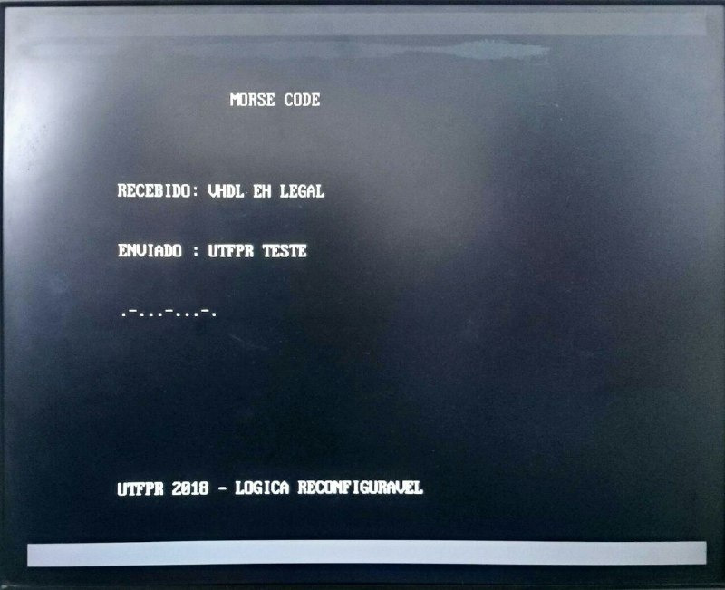

# Morse Code - FPGA
Projeto para recepção e transmissão de código Morse.
 - O controle de entrada de caractere é
capaz de inserir caracteres através do
padrão Morse (ex: . . . = caractere 'S');
 - Cada caractere inserido é exibido
na tela, acumulando os caracteres
recebidos até o limite máximo MAX;
 - Ao atingir MAX, o sistema emite um
som de erro, indicando que não pode
receber novos caracteres;
 - O sistema é capaz de 
transmitir os caracteres presentes no buffer para
outro sistema compatível, utilizando
também código Morse;
 - O sistema respeita o seguite protocolo de 
comunicação:
   - Um sistema só transmite se existe um
outro sistema para receber;
   - O sistema transmitindo ou recebendo
desabilita a entrada de novos
caracteres nesse meio tempo;
   - Ambos os sistemas envolvidos identificam a mensagem que estão
enviado/recebendo. 

__Hardware:__

 - O circuito principal está em uma FPGA (EP3C16F484C6);
 - É utilizado um display VGA;
 - O controle de entrada de caracteres em morse é
feito por um botão ligado à placa;
 - Há um botão para transmitir/desbufferizar a
mensagem acumulada.
 - Uma chave controla um loop de transmissão;
 - Ao inserir um caracter, um som é
tocado, identificando cada ponto e traço;
 - Uma fonte de luz externa acende
de acordo com as partes dos caracteres,
no momento de transmissão;
 - O status de transmitindo/recebendo/idle
por leds na placa.

 

 

----------------------

Projeto foi desenvolvido para a matéria de Lógica Reconfigurável - EL68A na UTFPR.  
Prof. Ricardo Pedroni
